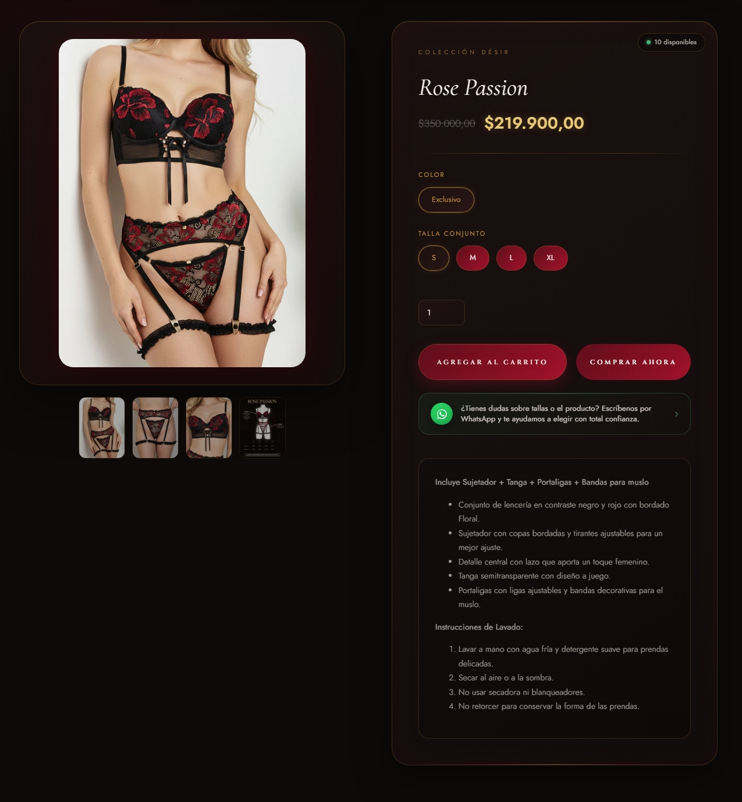

# Desir-E-commerce-Project

Colección de secciones y plantillas personalizadas desarrolladas en **Liquid**, **JavaScript** y **CSS3** para una tienda Shopify en producción. Este repositorio reúne una selección curada de los componentes más representativos del proyecto —no la totalidad del tema— como muestra de código real aplicado a un e-commerce funcional.

> 🔗 Tienda en vivo: [desir.store](https://desir.store)

---

## 📦 Contenido del repositorio

| Archivo | Descripción | Tecnologías destacadas |
|---|---|---|
| `HERO-PREMIUM` | Sección de portada con imagen o video de fondo configurable, título, subtítulo y botón de llamado a la acción. | Liquid, CSS (responsive, overlays) |
| `PRODUCTOS-DESTACADOS-PRO` | Carrusel de productos con scroll táctil, navegación por botones, badges animados y snippet reutilizable por producto. | Liquid, JavaScript, snippets `` |
| `GALERÍA-FLOTANTE-CARRUSEL` | Galería de imágenes con la foto activa centrada dinámicamente, navegación por swipe táctil, botones y dots. | JavaScript (eventos touch, cálculo dinámico de posición) |
| `PREGUNTAS-FRECUENTES-(FAQ)` | Acordeón de preguntas frecuentes, exclusivo (solo una respuesta abierta a la vez), con animación de entrada escalonada. | JavaScript, CSS (keyframes, transiciones) |
| `PRODUCT-LUXURY` | Plantilla completa de página de producto: selector de variantes dinámico, badge de stock en tiempo real y agregado al carrito vía AJAX sin recargar la página. | Liquid, JavaScript (Fetch API), Shopify Cart AJAX API |

Cada archivo incluye comentarios explicando su lógica y estructura.

---

## 🖼️ Vista previa

### Hero Premium

### Productos Destacados PRO

### Galería Flotante Carrusel

### Preguntas Frecuentes (FAQ)

### Product Luxury

---

## 🛠️ Tecnologías utilizadas

- **Liquid** — lenguaje de plantillas de Shopify
- **JavaScript (vanilla)** — sin librerías externas
- **CSS3** — animaciones, diseño responsive (mobile-first)
- **Shopify Schema** — settings y bloques configurables desde el editor de temas
- **Shopify Cart AJAX API** — integración de carrito sin recargar la página

---

## 📱 Enfoque mobile-first

Todas las secciones fueron desarrolladas priorizando la experiencia en dispositivos móviles, con breakpoints y ajustes específicos para pantallas pequeñas (ver los bloques `@media` dentro de cada archivo).

---

## ℹ️ Nota

Este repositorio no representa el tema completo de la tienda, sino una selección de las secciones con mayor complejidad técnica (lógica condicional, JavaScript avanzado, integración con la API de Shopify), pensada como muestra de código para fines de portafolio.

---

## 📬 el63050@gmail.com

**Emanuel López García**
Desarrollador de Software

